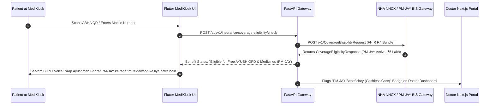
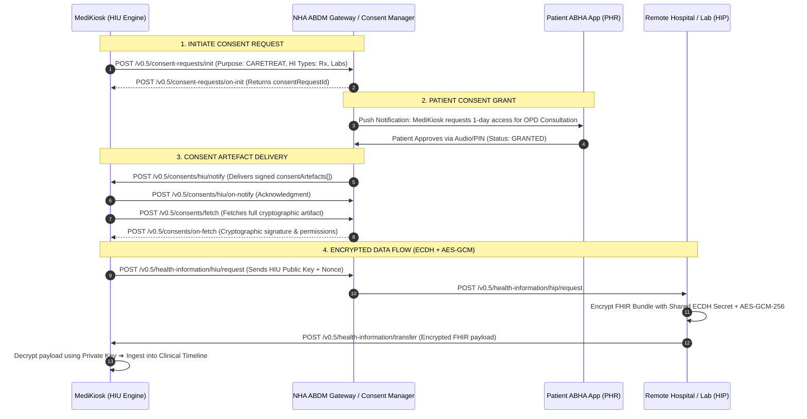

# 🔐 MediKiosk — ABDM Architecture, NRCeS FHIR R4, M3_V1, NHCX & DPDPA 2023 Specification

**Document Version:** `1.3.0-PROD`  
**Status:** Approved for Implementation  
**NHA Standards:** [NRCeS FHIR R4 Profiles](https://nrces.in/ndhm/fhir/r4/) | [ABDM_M3_V1 HIU Specification](https://sandbox.abdm.gov.in/sandbox/v3/new-documentation?doc=ABDM_M3_V1) | [National Health Claims Exchange (NHCX)](https://nrces.in/ndhm/fhir/r4/)  
**SIH Problem Statement ID:** `26047`  

---

## 1. ABDM & NHCX National Digital Health Architecture

The National Health Authority (NHA) digital health infrastructure integrates patient identity, clinical data exchange, and insurance scheme eligibility across 5 standardized layers:

```
┌──────────────────────────────────────────────────────────────────────────────────────────────────┐
│                                 NHA DIGITAL HEALTH ECOSYSTEM LAYERS                              │
├──────────────────────────────────────────┬───────────────────────────────────────────────────────┤
│ 1. Identity Layer (ABDM M1)              │ ABHA Number (14-Digit) + ABHA Address (name@abdm)     │
│ 2. Registry Layer (HFR / HPR)            │ Health Facility Registry (HFR) + Healthcare Pro (HPR) │
│ 3. Coverage Eligibility (NHCX / BIS)     │ CoverageEligibilityRequest (PM-JAY & State Schemes)   │
│ 4. Data Exchange (ABDM M2/M3)            │ NRCeS FHIR R4 DocumentBundle via Curve25519 + AES-GCM │
│ 5. Unified Health Interface (UHI)        │ Open Network Protocol for Teleconsultation & Booking  │
└──────────────────────────────────────────┴───────────────────────────────────────────────────────┘
```

---

## 2. NHCX Scheme & Insurance Eligibility Verification (`CoverageEligibilityRequest`)

### 2.1 Clinical & Social Objective
In public hospitals, patients frequently pay out-of-pocket for diagnostic tests and medicines because they are unaware of their active entitlement under **Ayushman Bharat PM-JAY (₹5 Lakh annual coverage)** or state-sponsored health programs.

When a patient identifies themselves at MediKiosk via ABHA, the kiosk queries the **National Health Claims Exchange (NHCX)** using the official **NRCeS FHIR R4 `CoverageEligibilityRequest`** profile:



---

### 2.2 NRCeS FHIR R4 `CoverageEligibilityRequest` Payload Contract

```json
{
  "resourceType": "CoverageEligibilityRequest",
  "id": "eligibility-req-0042",
  "meta": {
    "profile": ["https://nrces.in/ndhm/fhir/r4/StructureDefinition/CoverageEligibilityRequest"]
  },
  "status": "active",
  "purpose": ["benefits", "discovery"],
  "patient": {
    "reference": "Patient/pat-048291",
    "identifier": {
      "system": "https://healthid.ndhm.gov.in",
      "value": "91-4829-1029-4821"
    }
  },
  "created": "2026-08-23T18:35:00Z",
  "provider": {
    "reference": "Organization/IN0110000142",
    "display": "All India Institute of Ayurveda (AIIA)"
  },
  "insurance": [
    {
      "focal": true,
      "coverage": {
        "display": "Ayushman Bharat Pradhan Mantri Jan Arogya Yojana (PM-JAY)"
      }
    }
  ]
}
```

---

## 3. Official ABDM M3_V1 Consent & Health Data Flow (HIU Role)



---

## 4. Validated NRCeS-Compliant HL7 FHIR R4 DocumentBundle Specification

In strict compliance with **NRCeS India FHIR R4 Profile (`bdl-11` invariant)**, the root bundle is of type `document`, and **`entry[0]` is mandatory `Composition`**:

```json
{
  "resourceType": "Bundle",
  "id": "bundle-enc-0042",
  "meta": {
    "versionId": "1",
    "lastUpdated": "2026-08-23T18:00:00Z",
    "profile": [
      "https://nrces.in/ndhm/fhir/r4/StructureDefinition/DocumentBundle"
    ]
  },
  "identifier": {
    "system": "https://medikiosk.gov.in/bundles",
    "value": "MEDIKIOSK-2026-ENC-0042"
  },
  "type": "document",
  "timestamp": "2026-08-23T18:00:00Z",
  "entry": [
    {
      "fullUrl": "urn:uuid:comp-0042",
      "resource": {
        "resourceType": "Composition",
        "id": "comp-0042",
        "meta": {
          "profile": ["https://nrces.in/ndhm/fhir/r4/StructureDefinition/OPConsultRecord"]
        },
        "status": "final",
        "type": {
          "coding": [
            {
              "system": "http://snomed.info/sct",
              "code": "371530004",
              "display": "Clinical consultation report"
            }
          ],
          "text": "Outpatient Clinical Consultation Record"
        },
        "subject": { "reference": "urn:uuid:pat-048291" },
        "encounter": { "reference": "urn:uuid:enc-0042" },
        "date": "2026-08-23T18:00:00Z",
        "author": [{ "reference": "urn:uuid:prac-01", "display": "Dr. Suresh Sharma" }],
        "title": "MediKiosk Structured Outpatient Intake Summary",
        "section": [
          {
            "title": "Chief Complaints & HPI",
            "code": { "coding": [{ "system": "http://snomed.info/sct", "code": "422843007", "display": "Chief complaint" }] },
            "entry": [{ "reference": "urn:uuid:cond-01" }]
          },
          {
            "title": "Current Medications",
            "code": { "coding": [{ "system": "http://snomed.info/sct", "code": "722442002", "display": "Medication section" }] },
            "entry": [{ "reference": "urn:uuid:med-01" }]
          },
          {
            "title": "Diagnostic Observations",
            "code": { "coding": [{ "system": "http://snomed.info/sct", "code": "423100009", "display": "Results section" }] },
            "entry": [{ "reference": "urn:uuid:obs-01" }]
          }
        ]
      }
    },
    {
      "fullUrl": "urn:uuid:pat-048291",
      "resource": {
        "resourceType": "Patient",
        "id": "pat-048291",
        "meta": {
          "profile": ["https://nrces.in/ndhm/fhir/r4/StructureDefinition/Patient"]
        },
        "identifier": [
          {
            "system": "https://healthid.ndhm.gov.in",
            "value": "91-4829-1029-4821"
          }
        ],
        "name": [{ "text": "Ramesh Chandra", "family": "Chandra", "given": ["Ramesh"] }],
        "telecom": [{ "system": "phone", "value": "+919876543210" }],
        "gender": "male",
        "birthDate": "1974-05-12"
      }
    },
    {
      "fullUrl": "urn:uuid:enc-0042",
      "resource": {
        "resourceType": "Encounter",
        "id": "enc-0042",
        "meta": {
          "profile": ["https://nrces.in/ndhm/fhir/r4/StructureDefinition/Encounter"]
        },
        "status": "in-progress",
        "class": {
          "system": "http://terminology.hl7.org/CodeSystem/v3-ActCode",
          "code": "AMB",
          "display": "Ambulatory Outpatient"
        },
        "subject": { "reference": "urn:uuid:pat-048291" },
        "period": { "start": "2026-08-23T17:55:00Z" }
      }
    },
    {
      "fullUrl": "urn:uuid:cond-01",
      "resource": {
        "resourceType": "Condition",
        "id": "cond-01",
        "meta": {
          "profile": ["https://nrces.in/ndhm/fhir/r4/StructureDefinition/Condition"]
        },
        "clinicalStatus": {
          "coding": [{ "system": "http://terminology.hl7.org/CodeSystem/condition-clinical", "code": "active" }]
        },
        "code": {
          "coding": [
            {
              "system": "http://snomed.info/sct",
              "code": "239873007",
              "display": "Osteoarthritis of knee (Sandhigata Vata)"
            }
          ],
          "text": "Bilateral knee joint pain with crepitus for 6 months"
        },
        "subject": { "reference": "urn:uuid:pat-048291" }
      }
    },
    {
      "fullUrl": "urn:uuid:med-01",
      "resource": {
        "resourceType": "MedicationStatement",
        "id": "med-01",
        "meta": {
          "profile": ["https://nrces.in/ndhm/fhir/r4/StructureDefinition/MedicationStatement"]
        },
        "status": "active",
        "medicationCodeableConcept": {
          "coding": [
            {
              "system": "http://snomed.info/sct",
              "code": "318851002",
              "display": "Telmisartan 40mg Tablet"
            }
          ],
          "text": "Telma 40 (Telmisartan 40mg)"
        },
        "subject": { "reference": "urn:uuid:pat-048291" },
        "dosage": [{ "text": "1-0-0 After food daily" }]
      }
    },
    {
      "fullUrl": "urn:uuid:obs-01",
      "resource": {
        "resourceType": "Observation",
        "id": "obs-01",
        "meta": {
          "profile": ["https://nrces.in/ndhm/fhir/r4/StructureDefinition/Observation"]
        },
        "status": "final",
        "code": {
          "coding": [
            {
              "system": "http://loinc.org",
              "code": "3084-1",
              "display": "Urate [Mass/volume] in Serum or Plasma"
            }
          ]
        },
        "subject": { "reference": "urn:uuid:pat-048291" },
        "valueQuantity": {
          "value": 7.8,
          "unit": "mg/dL",
          "system": "http://unitsofmeasure.org",
          "code": "mg/dL"
        },
        "interpretation": [
          {
            "coding": [{ "system": "http://terminology.hl7.org/CodeSystem/v3-ObservationInterpretation", "code": "H", "display": "High" }]
          }
        ],
        "referenceRange": [{ "low": { "value": 3.5 }, "high": { "value": 7.2 } }]
      }
    }
  ]
}
```
